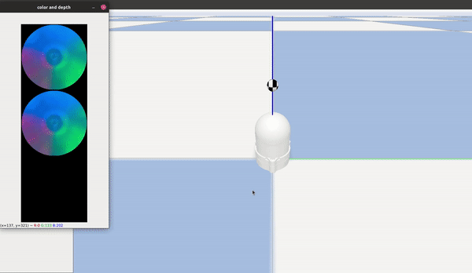

<div align="center">
<h1 align="center">
<!--  -->
<br>allsight_sim2real</h1>
<h3>Augmenting Tactile Simulators with Real-like and Zero-Shot Capabilities</h3>

<p align="center">


</p>


</div>

---

## 📖 Table of Contents

- [📖 Table of Contents](#-table-of-contents)
- [📍 Overview](#-overview)
- [:key: Key Features](#key-key-features)
    - [Allsight Sim](#allsight-sim)
    - [SightGAN](#sightgan)
- [📂 Contents](#-contents)
- [🚀 Getting Started](#-getting-started)
  - [🔧 Installation](#-installation)
  - [🤖 Running allsight\_sim2real](#-running-allsight_sim2real)
- [📄 License](#-license)
- [👏 Acknowledgments](#-acknowledgments)
- [:clipboard: BibTeX](#clipboard-bibtex)
---


## 📍 Overview
This repository contains the code and resources related to the paper ["Augmenting Tactile Simulators with Real-like and Zero-Shot Capabilities"](https://arxiv.org/abs/2309.10409) (under review). The paper introduces SightGAN, a cutting-edge solution for enhancing tactile perception in high-resolution tactile sensors such as [allsight](https://github.com/osheraz/allsight) sensor.

---

## :key: Key Features


#### Allsight Sim

The simulation data was obtained using tha [allsight_sim](https://github.com/osheraz/allsight_sim) package that utilizing [TACTO](https://github.com/facebookresearch/tacto)
a physics-engine simulator for optical-based tactile sensors.

For more information about the simulation package please see the link provided above.

- Example for data collection session


#### SightGAN
A bi-directional Generative Adversarial Network which built upon [CycleGAN](https://github.com/junyanz/pytorch-CycleGAN-and-pix2pix) and designed to bridge the reality gap between simulated and real tactile data, particularly for high-resolution tactile sensors.

<h1 align="center">

</h1>

SightGAN introduces contact-specific consistency losses:
- Spatial Contact Consistency loss
- Pixel-wise Contact Region Consistency loss

The GAN diagram and training process can be represented as follow:

<h1 align="center">

</h1>

- Example of SightGAN integrated in the simulation



---

## 📂 Contents

This repository contains several directories with the details as follow: 


<details closed><summary>Root</summary>

| File                                                                                                                      | Summary                   |
| ---                                                                                                                       | ---                       |
| [requirements.txt](https://github.com/RobLab-Allsight/allsight_sim2real/blob/main/requirements.txt)                       | Dependencies file |
| [train.py](https://github.com/RobLab-Allsight/allsight_sim2real/blob/main/train.py)                                       | Train the GAN model|
| [test.py](https://github.com/RobLab-Allsight/allsight_sim2real/blob/main/test.py)                                         | Test the GAN model |
| [train_regressor.py](https://github.com/RobLab-Allsight/allsight_sim2real/blob/main/train_regressor.py)                   | Train the regressor model only |
| [train_regressor_finetune.py](https://github.com/RobLab-Allsight/allsight_sim2real/blob/main/train_regressor_finetune.py) | Train a pre-trained regressor model with additional data |

</details>

<details closed><summary>Options</summary>
Python files forked from CycleGAN repo

</details>

<details closed><summary>Models</summary>


| File                                                                                                                      | Summary                   |
| ---                                                                                                                       | ---                       |
| [diff_cycle_gan_model.py](https://github.com/RobLab-Allsight/allsight_sim2real/blob/main/models/diff_cycle_gan_model.py)                       | The class of SightGAN model with its auxilliary losses |

All the rest of the files were forked from CycleGAN and helps for building and managing the models during training and test procedures.

</details>

<details closed><summary>Data_process</summary>

| File                                                                                                                                   | Summary                   |
| ---                                                                                                                                    | ---                       |
| [merge_json_sim.py](https://github.com/RobLab-Allsight/allsight_sim2real/blob/main/data_process/merge_json_sim.py)                     | Merging all the dataset from simulation into main json file database |
| [sim2gan_json.py](https://github.com/RobLab-Allsight/allsight_sim2real/blob/main/data_process/sim2gan_json.py)                         | Updata the json file with generated image pathes |
| [filter_real_images.py](https://github.com/RobLab-Allsight/allsight_sim2real/blob/main/data_process/filter_real_images.py)             | Filtering the real data and creating a json file database |
| [transfer_images.py](https://github.com/RobLab-Allsight/allsight_sim2real/blob/main/data_process/transfer_images.py)                   | Transfering iamges from sim and real databases to the train/test folders |
| [add_diff_frame.py](https://github.com/RobLab-Allsight/allsight_sim2real/blob/main/data_process/add_diff_frame.py)                     | update the json file with the substracted images |

</details>

<details closed><summary>Train_allsight_regressor</summary>

A Python package for training the spatial contact estimator and inherit the models.

</details>

<details closed><summary>Util</summary>

Python files forked from CycleGAN repo


</details>

---

## 🚀 Getting Started

***Dependencies***

Please ensure you have the following dependencies installed on your system.

Project was tested on:
- Ubuntu 18/20
- python >= 3.8

### 🔧 Installation

1. Clone the allsight_sim2real repository:
```sh
git clone https://github.com/RobLab-Allsight/allsight_sim2real
```

2. Change to the project directory:
```sh
cd allsight_sim2real
```

3. Install the dependencies:
```sh
pip install -r requirements.txt
```

### 🤖 Running allsight_sim2real

NOTE: Be aware for the pathes adjusts and adaptation for your custom dataset. 

NOTE: Please Be aware for the arguments adjusts needed for every script.

Assuming you have a dataset folder and updated package with the relevant pathes to your dataset:

Filter the real data:
```sh
python3 data_process/filter_real_images.py 
```

Merge sim data:
```sh
python3 data_process/merge_json_sim.py 
```

Add diff frame:
```sh
python3 data_process/add_diff_frame.py
```

Transfer images to gan folders: 
```sh
python3 data_process/transfer_images.py 
```

Train CycleGAN:
```sh
python3 train.py <arguments> 
```


---

## 📄 License

This repository is licensed under the MIT [License](/LICENSE). Feel free to use, modify, and distribute the code as per the terms of this license.

---

## 👏 Acknowledgments

- Our code is inspired by [CyclGAN](https://github.com/junyanz/pytorch-CycleGAN-and-pix2pix).
- Simulation was implemented using [TACTO](https://github.com/facebookresearch/tacto). 


---
## :clipboard: BibTeX

```
@misc{azulay2023augmenting,
      title={Augmenting Tactile Simulators with Real-like and Zero-Shot Capabilities}, 
      author={Osher Azulay and Alon Mizrahi and Nimrod Curtis and Avishai Sintov},
      year={2023},
      eprint={2309.10409},
      archivePrefix={arXiv},
      primaryClass={cs.RO}
}
```


[↑ Return](#Top)

---
