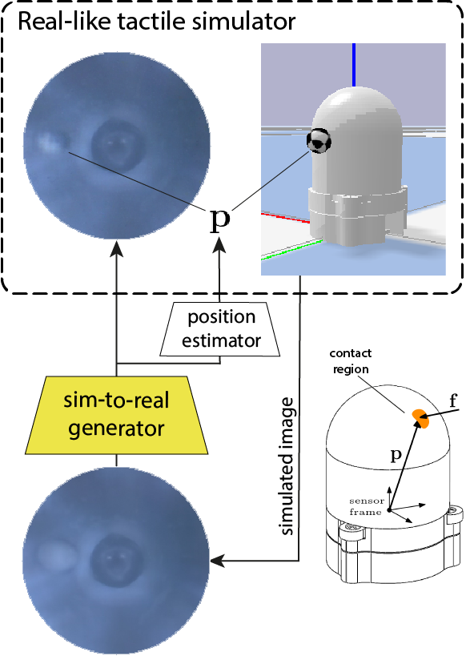
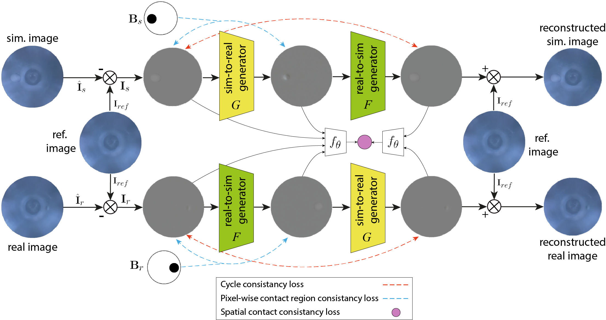

<div align="center">
<h1 align="center">
<!--  -->
<br>allsight_sim2real</h1>
<h3>Augmenting Tactile Simulators with Real-like and Zero-Shot Capabilities</h3>

<p align="center">


</p>


</div>

---

## 📖 Table of Contents

- [📖 Table of Contents](#-table-of-contents)
- [📍 Overview](#-overview)
- [:key: Key Features](#key-key-features)
    - [SightGAN](#sightgan)
    - [Allsight Sim](#allsight-sim)
- [📂 Contents](#-contents)
- [🚀 Getting Started](#-getting-started)
  - [🔧 Installation](#-installation)
  - [🤖 Running allsight\_sim2real](#-running-allsight_sim2real)
- [📄 License](#-license)
- [👏 Acknowledgments](#-acknowledgments)

---


## 📍 Overview
This repository contains the code and resources related to the paper ["Augmenting Tactile Simulators with Real-like and Zero-Shot Capabilities"](https://arxiv.org/abs/2309.10409) (under review). The paper introduces SightGAN, a cutting-edge solution for enhancing tactile perception in high-resolution tactile sensors such as [allsight](https://github.com/osheraz/allsight) sensor.

---

## :key: Key Features
#### SightGAN
A bi-directional Generative Adversarial Network which built upon CycleGAN and designed to bridge the reality gap between simulated and real tactile data, particularly for high-resolution tactile sensors.



SightGAN introduces contact-specific consistency losses:
- Spatial Contact Consistency loss
- Pixel-wise Contact Region Consistency loss

The GAN diagram and training process can be represented as follow:




#### Allsight Sim

The simulation data was obtained using tha [allsight_sim](https://github.com/osheraz/allsight_sim) package that utilizing [TACTO](https://github.com/facebookresearch/tacto)
a physics-engine simulator for optical-based tactile sensors.

For more information about the simulation package please see the link provided above.

- Example for data collection session


---

## 📂 Contents

This repository contains several directories with the details as follow: 


<details closed><summary>Root</summary>

| File                                                                                                                      | Summary                   |
| ---                                                                                                                       | ---                       |
| [requirements.txt](https://github.com/RobLab-Allsight/allsight_sim2real/blob/main/requirements.txt)                       | Dependencies file |
| [train.py](https://github.com/RobLab-Allsight/allsight_sim2real/blob/main/train.py)                                       | Train the GAN model|
| [test.py](https://github.com/RobLab-Allsight/allsight_sim2real/blob/main/test.py)                                         | Test the GAN model |
| [train_regressor.py](https://github.com/RobLab-Allsight/allsight_sim2real/blob/main/train_regressor.py)                   | Train the regressor model only |
| [train_regressor_finetune.py](https://github.com/RobLab-Allsight/allsight_sim2real/blob/main/train_regressor_finetune.py) | Train a pre-trained regressor model with additional data |

</details>

<details closed><summary>Options</summary>
Python files forked from CycleGAN repo (link in the acknowldegments)

</details>

<details closed><summary>Models</summary>

| File                                                                                                                     | Summary                   |
| ---                                                                                                                      | ---                       |
| [networks.py](https://github.com/RobLab-Allsight/allsight_sim2real/blob/main/models/networks.py)                         | HTTPStatus Exception: 429 |
| [diff_cycle_gan_model.py](https://github.com/RobLab-Allsight/allsight_sim2real/blob/main/models/diff_cycle_gan_model.py) | HTTPStatus Exception: 429 |
| [test_model.py](https://github.com/RobLab-Allsight/allsight_sim2real/blob/main/models/test_model.py)                     | HTTPStatus Exception: 429 |
| [cycle_gan_model.py](https://github.com/RobLab-Allsight/allsight_sim2real/blob/main/models/cycle_gan_model.py)           | HTTPStatus Exception: 429 |
| [pre_process.py](https://github.com/RobLab-Allsight/allsight_sim2real/blob/main/models/pre_process.py)                   | HTTPStatus Exception: 429 |
| [base_model.py](https://github.com/RobLab-Allsight/allsight_sim2real/blob/main/models/base_model.py)                     | HTTPStatus Exception: 429 |

</details>

<details closed><summary>Data_process</summary>

| File                                                                                                                                   | Summary                   |
| ---                                                                                                                                    | ---                       |
| [merge_json_sim.py](https://github.com/RobLab-Allsight/allsight_sim2real/blob/main/data_process/merge_json_sim.py)                     | HTTPStatus Exception: 429 |
| [sim2gan_json.py](https://github.com/RobLab-Allsight/allsight_sim2real/blob/main/data_process/sim2gan_json.py)                         | HTTPStatus Exception: 429 |
| [vis_utils.py](https://github.com/RobLab-Allsight/allsight_sim2real/blob/main/data_process/vis_utils.py)                               | HTTPStatus Exception: 429 |
| [update_ref_frame_gan.py](https://github.com/RobLab-Allsight/allsight_sim2real/blob/main/data_process/update_ref_frame_gan.py)         | HTTPStatus Exception: 429 |
| [filter_real_images.py](https://github.com/RobLab-Allsight/allsight_sim2real/blob/main/data_process/filter_real_images.py)             | HTTPStatus Exception: 429 |
| [transfer_images.py](https://github.com/RobLab-Allsight/allsight_sim2real/blob/main/data_process/transfer_images.py)                   | HTTPStatus Exception: 429 |
| [display_images.py](https://github.com/RobLab-Allsight/allsight_sim2real/blob/main/data_process/display_images.py)                     | HTTPStatus Exception: 429 |
| [add_diff_frame.py](https://github.com/RobLab-Allsight/allsight_sim2real/blob/main/data_process/add_diff_frame.py)                     | HTTPStatus Exception: 429 |
| [compare_sim_real.py](https://github.com/RobLab-Allsight/allsight_sim2real/blob/main/data_process/compare_sim_real.py)                 | HTTPStatus Exception: 429 |
| [update_compose_frame_gan.py](https://github.com/RobLab-Allsight/allsight_sim2real/blob/main/data_process/update_compose_frame_gan.py) | HTTPStatus Exception: 429 |

</details>

<details closed><summary>Train_allsight_regressor</summary>

| File                                                                                                                 | Summary                   |
| ---                                                                                                                  | ---                       |
| [img_utils.py](https://github.com/RobLab-Allsight/allsight_sim2real/blob/main/train_allsight_regressor/img_utils.py) | HTTPStatus Exception: 429 |
| [vis_utils.py](https://github.com/RobLab-Allsight/allsight_sim2real/blob/main/train_allsight_regressor/vis_utils.py) | HTTPStatus Exception: 429 |
| [models.py](https://github.com/RobLab-Allsight/allsight_sim2real/blob/main/train_allsight_regressor/models.py)       | HTTPStatus Exception: 429 |
| [misc.py](https://github.com/RobLab-Allsight/allsight_sim2real/blob/main/train_allsight_regressor/misc.py)           | HTTPStatus Exception: 429 |
| [surface.py](https://github.com/RobLab-Allsight/allsight_sim2real/blob/main/train_allsight_regressor/surface.py)     | HTTPStatus Exception: 429 |
| [datasets.py](https://github.com/RobLab-Allsight/allsight_sim2real/blob/main/train_allsight_regressor/datasets.py)   | HTTPStatus Exception: 429 |
| [geometry.py](https://github.com/RobLab-Allsight/allsight_sim2real/blob/main/train_allsight_regressor/geometry.py)   | HTTPStatus Exception: 429 |

</details>

<details closed><summary>Util</summary>

| File                                                                                               | Summary                   |
| ---                                                                                                | ---                       |
| [image_pool.py](https://github.com/RobLab-Allsight/allsight_sim2real/blob/main/util/image_pool.py) | HTTPStatus Exception: 429 |
| [util.py](https://github.com/RobLab-Allsight/allsight_sim2real/blob/main/util/util.py)             | HTTPStatus Exception: 429 |
| [visualizer.py](https://github.com/RobLab-Allsight/allsight_sim2real/blob/main/util/visualizer.py) | HTTPStatus Exception: 429 |
| [html.py](https://github.com/RobLab-Allsight/allsight_sim2real/blob/main/util/html.py)             | HTTPStatus Exception: 429 |

</details>

---

## 🚀 Getting Started

***Dependencies***

Please ensure you have the following dependencies installed on your system.

Project was tested on:
- Ubuntu 18/20
- python >= 3.8

### 🔧 Installation

1. Clone the allsight_sim2real repository:
```sh
git clone https://github.com/RobLab-Allsight/allsight_sim2real
```

2. Change to the project directory:
```sh
cd allsight_sim2real
```

3. Install the dependencies:
```sh
pip install -r requirements.txt
```

### 🤖 Running allsight_sim2real


---

## 📄 License

This repository is licensed under the MIT License. Feel free to use, modify, and distribute the code as per the terms of this license.
//MIT LICENSE

---

## 👏 Acknowledgments

- Our code is inspired by [CyclGAN](https://github.com/junyanz/pytorch-CycleGAN-and-pix2pix).
- Simulation was implemented using [TACTO](https://github.com/facebookresearch/tacto). 


[↑ Return](#Top)

---
